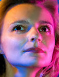
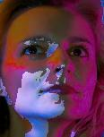
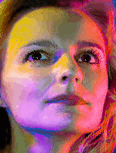
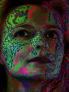
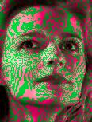
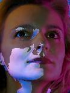
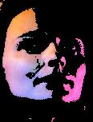
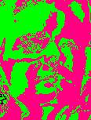
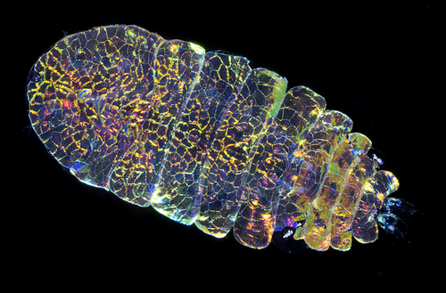
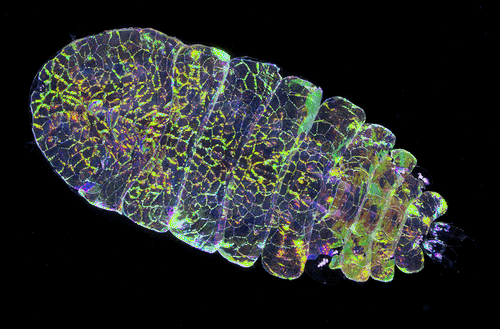

# HUSL color space conversion
A color space conversion library that works with `numpy` arrays. See [www.husl-colors.org](www.husl-colors.org) for more information about the HUSL color space.

     

## Example 1: Highlighting bluish regions
Let's say we need to highlight the bluish regions in this image:


We'll read the image into a `numpy.ndarray` and proceed from there.

```python
import imread  # a great library for reading images as numpy arrays
import nphusl 

# read in an ndarray of uint8 RGB values
img = imread.imread("images/gelface.jpg")
out = img.copy()  # the array we'll modify in the next examples
```

#### Example 1A: With the HUSL color space

The HUSL color space makes this pretty easy. Blue hues are roughly between
250 and 290 in HUSL.

```python
# make a transformed copy of the image array
hue = nphusl.to_hue(img)  # a 2D array of HUSL hue values
bluish = np.logical_and(hue > 250, hue < 290)  # create a mask for bluish pixels
out[~bluish] *= 0.5  # non-bluish pixels darkened
```

At this point, the `out` image looks like what we'd expect:


#### Example 1B: With the RGB color space

With the RGB color space, we have to examine each color channel and select
pixels that match three conditions:

1. a pixel's blue channel must be greater than its red channel
2. a pixel's blue channel must be greater than its green channel
3. a pixel's blue channel must be greater than some arbitrary number
   (depending on just *how blue* we want our selection to be)

```python
R, G, B = (img[..., n] for n in range(3))  # break out RGB color channels

# we'll try to create a bluish selection by choosing pixels for which
# the blue channel has a greater value than the others
bluish = np.logical_and(B > R, B > G)  # no overpowering red or green
bluish = np.logical_and(bluish, B > 125)  # strong enough blue channel
out[~bluish] *= 0.5  # non-bluish pixels darkened
```

Again, we get approximately what we hoped for:



Working with plain red, green, or blue doesn't present a very challenging
problem, but the clarity of having hue on its own separate channel is
still apparent. The separation of hue and and lightness into distinct channels
can lend even more flexibility. The next examples illustrate this.


## Example 2: Highlighting bright regions

This example shows the ease of selecting pixels based on perceived
"luminance" or "lightness" with HUSL.

```python
hsl = nphusl.to_husl(img)  # a 3D array of HUSL hue, saturation, and lightness
lightness = hsl[..., 2]  # just the lightness channel
dark = lightness < 62  # a simple choice, since lightness is in (0..100)
out[dark] = 0x00  # change selection to black
```

This code gives us the light regions of the subject's face with a
black background:




## Example 3: Melonize

As a completely arbitrary challenge, let's highlight small changes in hue.
We'll walk along the HUSL hue spectrum in steps of 5 (the HUSL hue range
runs from 0 to 360). As we walk through each hue range, we'll alternate our
effect on the image's pixels to create green and pink striations -- a
kind of "watermelon" effect.

```python
hsl = nphusl.to_husl(img)
pink =  0xFF, 0x00, 0x80
green = 0x00, 0xFF, 0x00
chunksize = 45
for low, high in nphusl.chunk(360, chunksize):  # chunks of the hue range
    select = np.logical_and(hue > low, hue < high)
    is_odd = low % (chunksize * 2)
    color = pink if is_odd else green
    out[select] = color
```

This code gives us a nicely melonized face:



One thing I don't like about this is that the image looks flat!
This is because our transormation focused only on *hue*. The light/dark
regions give the image depth. We can restore the original depth by using
our HUSL lightness value as a multiplier.

```python
light_pct = lightness / 100  # lightness as a fraction of 100
out *= light_pct[:, :, None]  # multiply 3D RGB by 2D lightness fraction
```

That gives us the same melonized subject, but with dark regions that
receed into the background dramatically:


Finally, we can play with the `chunksize` variable to break the linear
hue range into smaller pieces. This results in tighter, more melon-like
striations on the subject's face. Here's the output with `chunksize = 5`:


## Example 4: Animating with hue and lightness

HUSL's separate hue and lightness channels allow us to animate hue and
lightness in clever ways with [moviepy](https://github.com/Zulko/moviepy).
To produce a disco effect, we need a function that will slide the hue along
its axis, use modulo to keep it within the valid HUSL hue bounds, and adjust
brightness periodically to create a cool "pulse" effect. Here's what it looks
like:

```python
def hue_rainbow(img, n_frames):
    hue_delta = 360.0 / n_frames
    min_lightness = 40
    max_lightness = 90
    hsl = nphusl.to_husl(img)
    H, _, L = (hsl[..., n] for n in range(3))
    bright = L > min_lightness
    hsl_bright = hsl[bright]
    h_bright = H[bright]
    l_bright = L[bright]
    rgb = nphusl.to_rgb(hsl)
    while True:
        h_bright += hue_delta
        np.mod(h_bright, 360.0, out=h_bright)
        l_bright[h_bright < 60] += 1
        l_bright[h_bright > 300] -= 1
        l_bright[l_bright > max_lightness] = max_lightness
        l_bright[l_bright < min_lightness] = min_lightness
        hsl[..., 2][bright] = l_bright
        hsl[..., 0][bright] = h_bright
        new_rgb = nphusl.to_rgb(hsl[bright])
        rgb[bright] = new_rgb
        yield rgb
```

This generator increases hue linearly, and uses `np.mod` to have the hue wrap
around HUSL's 0-360 scale. Since HUSL's hues link together in a smooth fashion,
these changes will never look very jarring. Next, we change the lightness
value by a single percentage point. We either increase or decrease based on
whether the hue is in a certain range as a way of diminishing some hues and
bringing out others. Notice that we're making out modfications in the 
HSL color space and then converting back to RGB with `to_rgb`.

Next, we need to assemble an animation from these the frame
generator. MoviePy makes this easy. The animation should be a perfect
loop, so we calculate the duration based on `n_frames` and `fps`.

```python
n_frames = 25 
fps = 24
duration = n_frames / fps
rainbow_frames = hue_rainbow(img, n_frames)
animation = VideoClip(lambda _: next(rainbow_frames), duration=duration)
animation.write_gif("video.gif", fps=fps)
```

Here's our subject at the discotheque:


The sapphirina is a tiny crustacean known for its brilliant coloration.
[According to Wikipedia](https://en.wikipedia.org/wiki/Sapphirina):

> Various species of male Sapphirina shine in different hues, from bright gold
> to deep blue. This is partially due to structural coloration in which
> microscopic layers of crystal plates inside their cells which are separated
> by minute distances, and these distances equal the same wavelength of the
> corresponding color of their "shine".



Here's our sapphirina at the discotheque:



