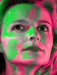

# HUSL color space conversion
A color space conversion library that works with `numpy` arrays. See [www.husl-colors.org](www.husl-colors.org) for more information about the HUSL color space.

     


## Features

1. Fast conversion to RGB from HUSL and vice versa. Convert a 1080p image to HUSL in less than a second.
2. Seamless performance improvements with `NumExpr`, `Cython`, and `OpenMP` (whichever's available).
3. Flexible `numpy` arrays as inputs and outputs. Plays nicely with `OpenCV`, `MoviePy`, etc.

## Installation

a. virtualenv env -p python3
b. source env/bin/activate

1. `pip install numpy`
2. `pip install Cython`  (or `NumExpr`, but `Cython` is preferred)
3. `pip install git+https://github.com/TadLeonard/husl-numpy.git`

## Usage

### Setup

```python
import nphusl
import imread # for reading images as numpy arrays
img = imread.imread("path/to/img.jpg")
```

### The basics

```python
# convert to HUSL (HSL)
hsl = nphusl.to_husl(img)

# convert to HUSL (just hue)
hue = nphusl.to_hue(img)
np.all(hsl[..., 0] == hue)  # True, they're the same

# back to RGB
rgb = nphusl.to_rgb(hsl)
np.all(rgb == img)  # True
```

### Performance adjustments

```python
# Choose specific optimizations
# By default the best available optimizations are used
nphusl.enable_standard_fns()  # only numpy is used
nphusl.enable_numexpr_fns()  # numexpr used if it's available
nphusl.enable_cython_fns()  # cython used if it's available (fastest)

# adjust chunksize for enormous images
# this processes the image in chunks of 1000x1000 pixels, which
# can drastically improve things if Cython isn't installed
huge_img = imread.imread("huge.jpg")
hsl = nphusl.to_husl(huge_img, chunksize=1000)
```

## Example 1: Highlighting bluish regions
Let's say we need to highlight the bluish regions in this image:


First, we'll load our image into a `numpy` array.

```python
import imread  # a great library for reading images as numpy arrays
import nphusl 

# read in an ndarray of uint8 RGB values
img = imread.imread("images/gelface.jpg")
out = img.copy()  # the array we'll modify in the next examples
```

Blue hues are roughly between 250 and 290 in the HUSL color space.

```python
hue = nphusl.to_hue(img)  # a 2D array of HUSL hue values
bluish = np.logical_and(hue > 250, hue < 290)  # create a mask for bluish pixels
out[~bluish] *= 0.5  # non-bluish pixels darkened
```

At this point, the `out` image looks like what we'd expect:


Note that this is harder to achieve with the RGB color space.
With RGB, we have to examine each color channel and select
pixels that match three conditions:

1. a pixel's blue channel must be greater than its red channel
2. a pixel's blue channel must be greater than its green channel
3. a pixel's blue channel must be greater than some arbitrary number
   (depending on just *how blue* we want our selection to be)

```python
R, G, B = (img[..., n] for n in range(3))  # break out RGB color channels

# we'll try to create a bluish selection by choosing pixels for which
# the blue channel has a greater value than the others
bluish = np.logical_and(B > R, B > G)  # no overpowering red or green
bluish = np.logical_and(bluish, B > 125)  # strong enough blue channel
out[~bluish] *= 0.5  # non-bluish pixels darkened
```

Again, we get approximately what we hoped for:


Working with plain red, green, or blue doesn't present a very challenging
problem, but the clarity of having hue on its own separate channel is
still apparent. The separation of hue and and lightness into distinct channels
can lend even more flexibility. The next examples illustrate this.


## Example 2: Highlighting bright regions

This example shows the ease of selecting pixels based on perceived
"luminance" or "lightness" with HUSL.

```python
hsl = nphusl.to_husl(img)  # a 3D array of HUSL hue, saturation, and lightness
lightness = hsl[..., 2]  # just the lightness channel
dark = lightness < 62  # a simple choice, since lightness is in (0..100)
out[dark] = 0x00  # change selection to black
```

This code gives us the light regions of the subject's face against a
black background:


## Example 3: Melonize

As a completely arbitrary challenge, let's highlight small changes in hue.
We'll walk along the HUSL hue spectrum in steps of 5 (the HUSL hue range
runs from 0 to 360). As we walk through each hue range, we'll alternate our
effect on the image's pixels to create green and pink striations -- a
kind of "watermelon" effect.

```python
hsl = nphusl.to_husl(img)
pink =  0xFF, 0x00, 0x80
green = 0x00, 0xFF, 0x00
chunksize = 45
for low, high in nphusl.chunk(360, chunksize):  # chunks of the hue range
    select = np.logical_and(hue > low, hue < high)
    is_odd = low % (chunksize * 2)
    color = pink if is_odd else green
    out[select] = color
```

This code gives us a melonized face:


Our image looks a bit flat.
This is because our transormation focused only on *hue*. The light/dark
regions give the image depth. We can restore the image's depth by using
lightness as a multiplier, and it's easy with HUSL 'cause lightness
is a separate channel.

```python
light_pct = lightness / 100  # lightness as a fraction of 100
out *= light_pct[:, :, None]  # multiply 3D RGB by 2D lightness fraction
```

That gives us the same melonized subject, but with dark regions that
recede into the background dramatically:



Finally, we can play with the `chunksize` variable to break the linear
hue range into smaller pieces. This results in tighter, more melon-like
striations on the subject's face. Here's the output with `chunksize = 5`:


## Example 4: Microwave

HUSL's separate hue, saturation, and lightness channels allow us to animate 
in clever ways with [moviepy](https://github.com/Zulko/moviepy).
To produce a microwave "melt", we need a function that will create hue waves,
select regions of high saturation, and make "drips" by sliding lightness
values down.

```python
def microwave(img):
    hsl = nphusl.to_husl(img)
    hue, sat, lit = (hsl[..., i] for i in range(3))  # break out H, S, and L
    rows, cols = lit.shape
    yield nphusl.to_rgb(hsl)
    while True:
        for chunk, ((rs, re), (cs, ce)) in nphusl.chunk_img(hue, chunksize=3):
            hue_left = hue[rs, cs-1]
            hue_up = hue[rs-1, cs]
            this_hue = chunk[0, 0]
            new_hue = (-random.randrange(30, 50) * (hue_up / 360)
                       -10*random.randrange(1, 10) * (hue_left / 360))
            new_hue = (15*this_hue + 2*new_hue) / 17
            chunk[:] = new_hue
            if new_hue < 0 and re < rows-1:
                if np.max(sat[rs:re:, cs:ce]) > 70:
                    lit[rs+1:re+1, cs:ce] = lit[rs:re, cs:ce]
                    sat[rs+1:re+1, cs:ce] = sat[rs:re, cs:ce]
        np.mod(hue, 360, out=hue)
        yield nphusl.to_rgb(hsl)
```

Next, we need to assemble an animation from these the frame
generator. MoviePy makes this easy. The animation should be a perfect
loop, so we calculate the duration based on `n_frames` and `fps`.

```python
n_frames = 25 
fps = 24
duration = n_frames / fps
rainbow_frames = hue_rainbow(img, n_frames)
animation = VideoClip(lambda _: next(rainbow_frames), duration=duration)
animation.write_gif("video.gif", fps=fps)
```


